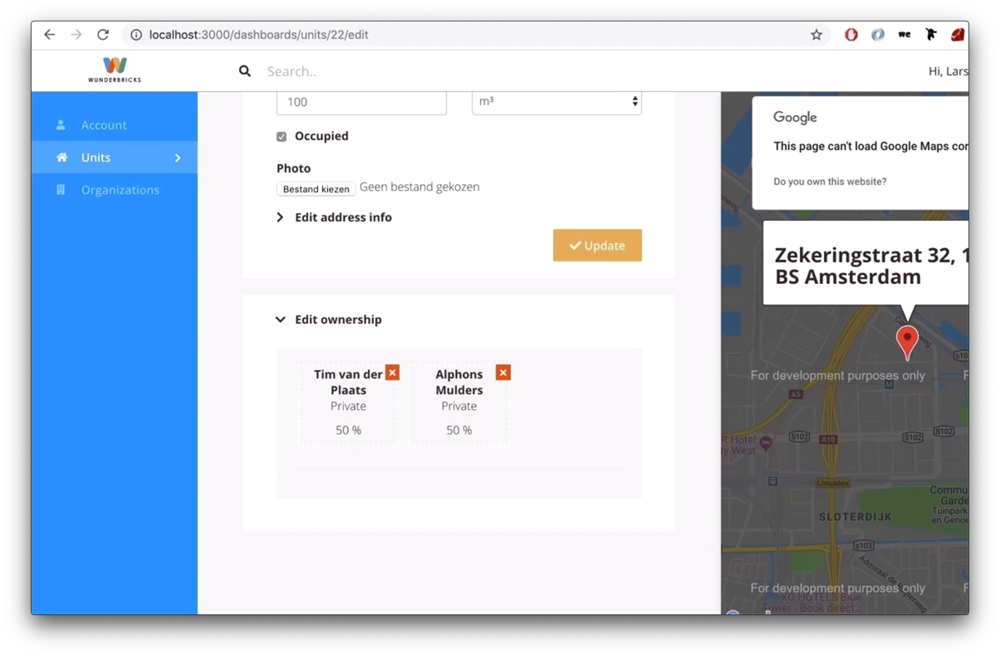

# The Chevron

## Round 1

I made this a few days ago, when you click the chevron `>` the block beneath it becomes visible and when you click it again it toggles back to hidden.

It’s pure CSS, no JavaScript at all. Can you tell me how I did it? Or make one yourself.

The simplest form is between 10 and 20 lines of CSS. If it gets much more than that ask me and explain your process.

## Round 2

1. The `<input type="checkbox">` is the right way to go. When a checkbox input is ‘checked’ it triggers a pseudo selector called `:checked` You can listen to `:checked` in order to hide or show elements.

2. Then there’s another thing, a label is connected by `id` to an input. That means that if you click the label, the input toggles.

In this case you can hide the actual input, because you don’t need it for this. In the label text you can put the *chevron* `> see more`.

3. Finally, the order of elements matters
because in CSS there are sibling selectors, `+` selects the next sibling, `~` selects all following siblings. But you can’t select a previous sibling or a parent. So the label, input and the element that you want to hide/show need to be adjacent siblings, in a certain order.

### Resources
[Can I have an onclick effect in CSS?](https://stackoverflow.com/questions/13630229/can-i-have-an-onclick-effect-in-css)

[Child and Sibling Selectors](https://css-tricks.com/child-and-sibling-selectors/)

[How do you order your CSS properties](https://css-tricks.com/poll-results-how-do-you-order-your-css-properties/)
